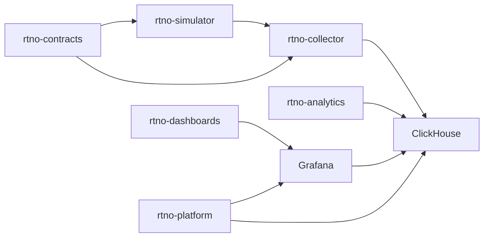

# Repository Architecture

This project is finalized as a six-repository system. Each repository has a single primary responsibility, clear ownership boundaries, and one-way dependencies so the project can grow like a professional service ecosystem without becoming fragmented too early.

## Repository Set

### `rtno-platform`

Owns local infrastructure, orchestration, and developer experience.

Includes:

- Docker Compose or equivalent local runtime wiring.
- ClickHouse configuration and schema migration entrypoints.
- Grafana provisioning integration.
- Makefile, task runner, or setup scripts for booting the system.
- Top-level operational docs for running the stack locally.

Does not include:

- Telemetry generation logic.
- Collector batching or retry logic.
- Anomaly detection business logic.
- Dashboard JSON ownership, except for mounting/provisioning it.

### `rtno-contracts`

Owns shared telemetry contracts and compatibility rules.

Includes:

- JSON Schema or Protobuf definitions for telemetry events.
- Schemas for packet/window events, router metadata, anomaly events, and ingestion status.
- Contract versioning guidance.
- Generated examples or fixtures used by service tests.

Does not include:

- Service runtime code.
- ClickHouse-specific query logic.
- Grafana dashboard definitions.
- Environment orchestration.

### `rtno-simulator`

Owns synthetic network telemetry generation.

Includes:

- Go CLI or service for generating aggregated router/interface traffic.
- Normal traffic profiles.
- Failure profiles such as packet-drop spikes, latency degradation, jitter, regional outages, and later replay mode.
- Contract-compatible JSONL or HTTP event output.

Does not include:

- ClickHouse inserts.
- Collector batching or backpressure.
- Anomaly scoring.
- Dashboard rendering.

### `rtno-collector`

Owns telemetry ingestion into ClickHouse.

Includes:

- Go daemon that receives or reads telemetry from the simulator.
- Contract validation.
- Batching, retries, backpressure, graceful shutdown, and ingestion metrics.
- ClickHouse write path for validated telemetry.

Does not include:

- Synthetic traffic generation.
- Long-term anomaly scoring rules.
- Grafana dashboard definitions.
- Local infrastructure ownership beyond its own service runtime configuration.

### `rtno-analytics`

Owns anomaly detection logic and analytical query definitions.

Includes:

- ClickHouse SQL for moving averages, error-rate deltas, EWMA, and baseline comparisons.
- Anomaly scoring definitions and documentation.
- Query fixtures or tests that validate expected anomaly behavior.
- Later streaming analytics service code if a queue is introduced.

Does not include:

- Raw telemetry generation.
- Collector ingestion mechanics.
- Grafana dashboard JSON ownership.
- Platform bootstrapping.

### `rtno-dashboards`

Owns visualization and alerting assets.

Includes:

- Grafana dashboard JSON.
- Alert rule definitions.
- Datasource-facing query panels and documentation.
- Screenshots or docs explaining panel intent.

Does not include:

- ClickHouse server configuration.
- Collector ingestion code.
- Analytics service runtime code.
- Shared event schema ownership.

## Dependency Direction

Dependencies must move in one direction:

- `rtno-simulator` depends on `rtno-contracts`.
- `rtno-collector` depends on `rtno-contracts`.
- `rtno-analytics` depends on the ClickHouse schema and telemetry contract.
- `rtno-dashboards` depends on stable query outputs from ClickHouse and analytics definitions.
- `rtno-platform` composes repositories and infrastructure, but does not own business logic.

No service repository should import from another service repository directly. Shared event shapes belong in `rtno-contracts`; shared runtime behavior should stay local until duplication creates a clear maintenance problem.

## Phase 1 Scope

Phase 1 uses direct ingestion:

Kafka, Redpanda, Terraform, Helm charts, generated SDK repositories, and separate migration repositories are intentionally out of scope for Phase 1.

## Initial Build Order

1. `rtno-contracts`: define the first packet/window telemetry event contract.
2. `rtno-platform`: boot ClickHouse and Grafana locally.
3. `rtno-simulator`: emit realistic contract-compatible traffic.
4. `rtno-collector`: validate, batch, and insert telemetry into ClickHouse.
5. `rtno-analytics`: add baseline and anomaly scoring queries.
6. `rtno-dashboards`: add Grafana panels and alerts.

## Initial Telemetry Contract Fields

The first telemetry event represents an aggregated time window, not one row per packet.

Required fields:

- `event_time`
- `router_id`
- `interface_id`
- `region`
- `packet_count`
- `drop_count`
- `latency_ms_p50`
- `latency_ms_p95`
- `jitter_ms`
- `protocol`
- `source`

## Boundary Checks

Use these checks when adding new work:

- If it defines event shape, put it in `rtno-contracts`.
- If it starts local dependencies, put it in `rtno-platform`.
- If it creates synthetic traffic, put it in `rtno-simulator`.
- If it validates, batches, retries, or inserts telemetry, put it in `rtno-collector`.
- If it scores or explains anomalies, put it in `rtno-analytics`.
- If it visualizes or alerts on data, put it in `rtno-dashboards`.

